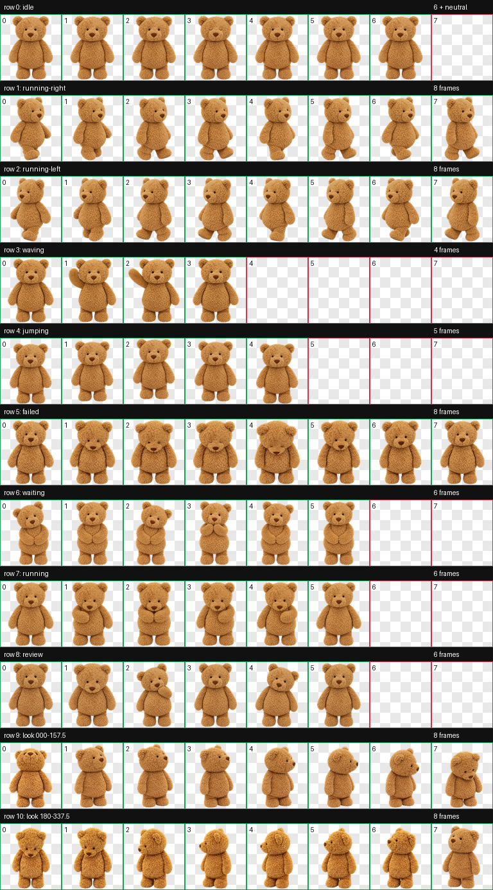
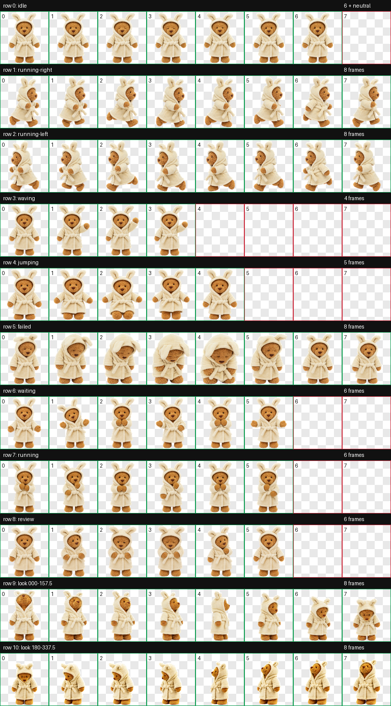
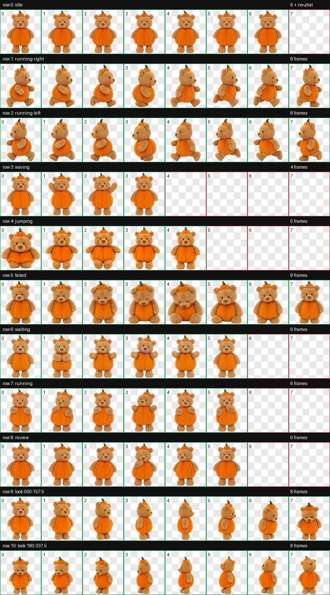
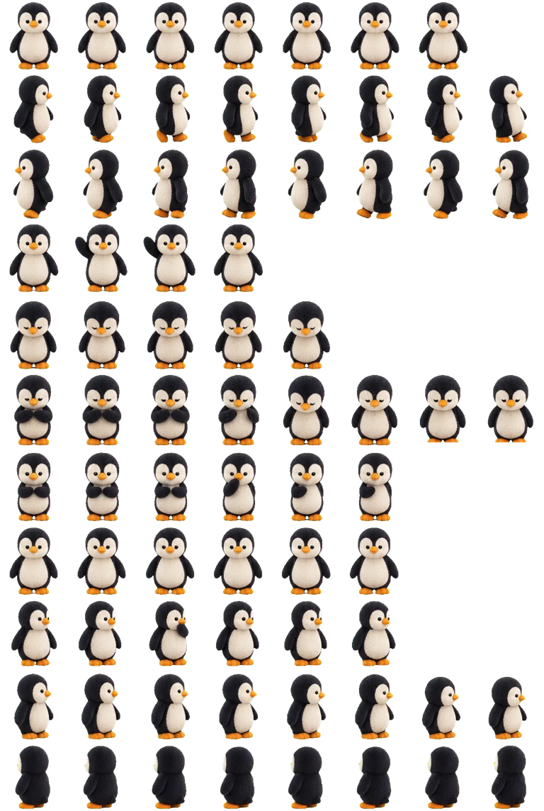
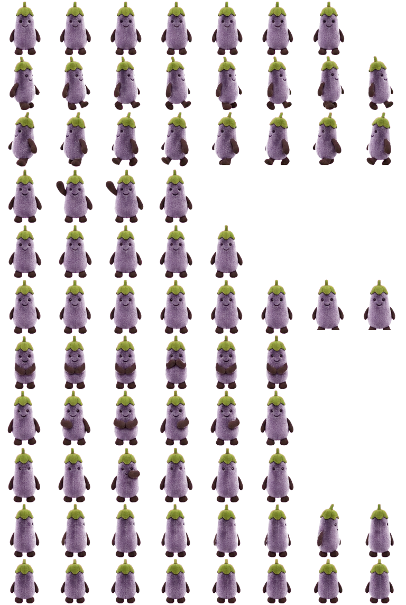

# Jellycat Codex Pet

五只可安装到 Codex 的 v2 Jellycat 灵感动画宠物。每只宠物包含 9 组工作状态动画和 16 个观察方向。

> [!IMPORTANT]
> 这是非官方、非商业的粉丝项目，与 Jellycat Limited 没有隶属、合作、赞助或认可关系。角色形象灵感来自 Jellycat 的 **Bartholomew Bear**、**Peanut Penguin** 和 **Amuseables Eggplant**；相关角色、商标和设计的权利归其各自权利人所有。

## 宠物

### 巴塞罗小熊



- Codex ID：`bartholomew-codex-bear`
- 安装目录：`pets/bartholomew-codex-bear`
- 官方形象参考：[Jellycat Bartholomew Bear](https://eu.jellycat.com/bartholomew-bear/)

### 巴塞罗浴袍小熊



- Codex ID：`bartholomew-bathrobe-codex-bear`
- 安装目录：`pets/bartholomew-bathrobe-codex-bear`
- 官方形象参考：[Jellycat Bartholomew Bear Bathrobe](https://us.jellycat.com/bartholomew-bear-bathrobe/)

### 巴塞罗南瓜小熊



- Codex ID：`bartholomew-pumpkin-codex-bear`
- 安装目录：`pets/bartholomew-pumpkin-codex-bear`
- 官方形象参考：[Jellycat Bartholomew Bear Pumpkin](https://us.jellycat.com/bartholomew-bear-pumpkin/)

### 花生小企鹅



- Codex ID：`peanut-penguin-codex-pet`
- 安装目录：`pets/peanut-penguin-codex-pet`
- 官方形象参考：[Jellycat Peanut Penguin](https://us.jellycat.com/peanut-penguin/)

### 茄子小伙伴



- Codex ID：`amuseables-eggplant-codex-pet`
- 安装目录：`pets/amuseables-eggplant-codex-pet`
- 官方形象参考：[Jellycat Amuseables Eggplant](https://us.jellycat.com/vivacious-vegetable-aubergine/)

## 安装

把想要的宠物目录复制到 Codex 自定义宠物目录：

```bash
mkdir -p ~/.codex/pets
cp -R pets/bartholomew-codex-bear ~/.codex/pets/
cp -R pets/bartholomew-bathrobe-codex-bear ~/.codex/pets/
cp -R pets/bartholomew-pumpkin-codex-bear ~/.codex/pets/
cp -R pets/peanut-penguin-codex-pet ~/.codex/pets/
cp -R pets/amuseables-eggplant-codex-pet ~/.codex/pets/
```

然后重启 Codex，在宠物选择器中选择对应宠物。

每个可安装目录均采用相同结构：

```text
pets/<pet-id>/
├── pet.json
└── spritesheet.webp
```

## 兼容性与质量

- Codex custom pet
- `spriteVersionNumber: 2`
- 8 × 11 atlas，单格 192 × 208 px
- 完整精灵图尺寸：1536 × 2288 px
- WebP RGBA 透明背景
- 五只宠物均已通过 Codex v2 图集结构校验

机器校验结果保存在 `qa/`。

## 来源与用途

- 项目性质：非官方粉丝创作，公开源文件
- 使用范围：个人、学习、研究和其他非商业用途
- 禁止将本项目或其素材用于销售、广告、商品化或其他商业用途
- 公开此仓库不表示授予任何 Jellycat 角色、商标或设计的权利

详细说明见 [ATTRIBUTION.md](ATTRIBUTION.md) 和 [LICENSE](LICENSE)。

## Takedown / Rights holder contact

如果你是相关权利人，并认为此仓库中的内容需要修改或移除，请通过 GitHub Issue 联系仓库维护者；维护者会配合处理。
